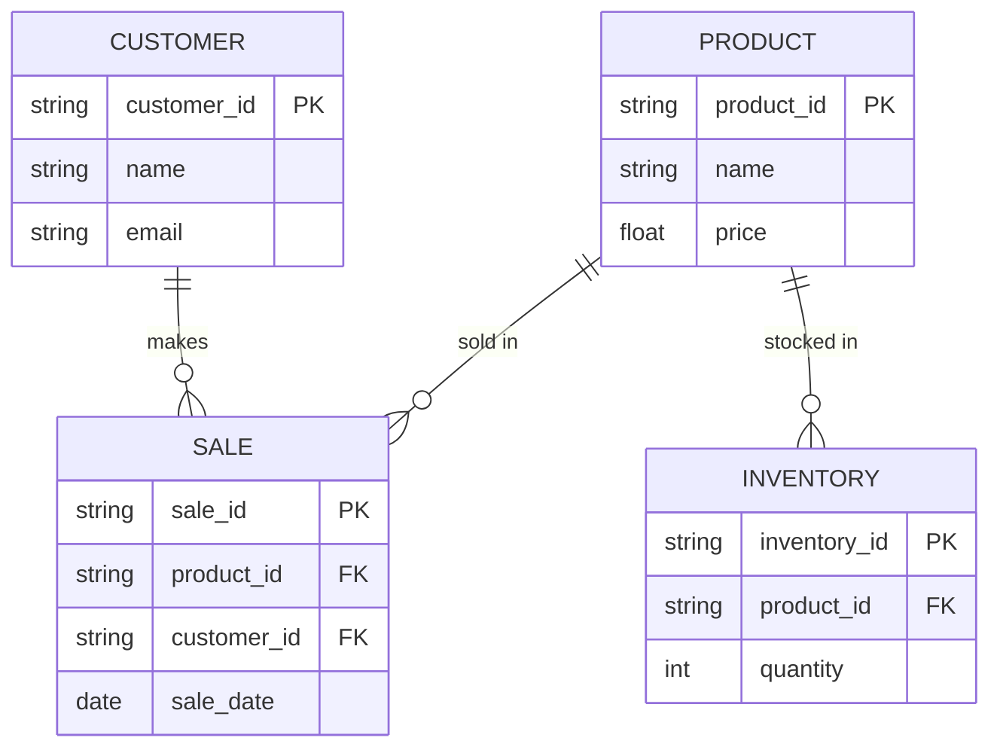

# NikeStore_ERD

## Entity Descriptions

- **PRODUCT**: Each product represents a Nike shoe model with a unique ID, name, and price.
- **CUSTOMER**: Customers who buy the shoes. Each has an ID, name, and email.
- **SALE**: Records each sale, connecting a product and a customer, with the date of the sale.
- **INVENTORY**: Tracks how many units of each product are in stock.

## Relationships

- One product can be sold in many sales.
- One customer can make many purchases.
- Inventory tracks how many of each product are available.